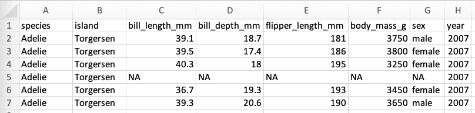

# (PART\*) Lab 9 {-}

# Data Analysis & Shiny Apps {-}

*Last updated `r Sys.Date()`*

In Lab 7 you had a short introduction to data visualization and using R through a Shiny App to explore some core descriptive and inferential statistics for a couple of pre-loaded data sets.

You may wish to re-familiarize yourself with the content of Lab 7, in particular the best practices for presenting tables and figures and how to navigate the Shiny App interface.

This lab, we\'ll be undertaking a similar exercise to what we did two weeks ago, but instead of working with a supplied data set, you\'ll be working with the data that you\'ve collected conducting your research.

# Preparing Your Data {-}

Before we can upload our data into the Shiny App, we need to ensure our data is in a format and structure that is suitable for analysis.

## Data Organization {-}

When we load our data into a program, that program is expecting our data to be organized in a particular way. The way that we should ideally organize our data is often referred to as Tidy Data.

Refer to the chapter [Tidy Data](https://ubco-biology.github.io/Procedures-and-Guidelines/tidy-data.html) in the Procedures and Guidelines document to help you get your data in order before continuing with the rest of the material here.

<div class="note">
**Missing Values**

If your data contain any missing values, make sure your have a standard way of filling those cells. Blank cells are not very useful - a blank cell tells us very little about why it\'s blank - Was this a mistake? Is it supposed to be empty? Who knows?

Instead, be purposeful. A standard filler or stand in for a missing piece of data is `NA`, standing for \"not available\". Your `_README` file or `_DATA-DICTIONARY` should indicate that missing data points are noted with `NA`.
</div>

Once you\'ve got your data organized in Excel - or whichever program your are using - according to the principles of Tidy Data and you\'ve ensured that any missing data points are filled with `NA`, you\'re ready to save your file in a format for import into the Shiny App.

If we were to use the `palmerpenguin` data from Lab 7 as an example, following is what our data in Excel might look like:



Note that we have a header row with values for each of the variables, including the species, island and various measurements taken. Since we have a header, when we import our data into the Shiny App, we\'ll want to make sure we\'re indicating that there\'s a header. We also have one row for each observation of an individual penguin.

<div class="note">
**Headers in Data Files**

Not all data that you come across will include a header in the file. Sometimes the variables are described exclusively in the `_Data-Dictionary` that accompanies the data set.
</div>

## File Formats {-}

Most of the data that you\'ll encounter or produce will be rectangular in nature; that is, it will organized into columns and rows. Rectangular data can be stored in many file formats with `xlsx` perhaps being the one you\'ll be most familiar with, which is an Excel file. To be fair, we could store this data within a Word document in a table. But if we want to be able to work programmatically with the data - if we want to be able to use a computer program to help interpret the data, perform calculations, make inferences, and build visualizations - the data needs to be in a file format that will allow for this. A Word document does not allow for this. An Excel file allows for this within Excel. But we can do better.

A common file format for storing rectangular data is a `csv` file, or comma separated value file. Each row in a csv file contains data for a single observation, and each piece of data is separated by a comma. If we were to look at the `palmerpenguin` data from Lab 7 saved as a csv, it would look something like:

```
"species","island","bill_length_mm","bill_depth_mm","flipper_length_mm","body_mass_g","sex","year"
"Adelie","Torgersen",39.1,18.7,181,3750,"male",2007
"Adelie","Torgersen",39.5,17.4,186,3800,"female",2007
"Adelie","Torgersen",40.3,18,195,3250,"female",2007
"Adelie","Torgersen",NA,NA,NA,NA,NA,2007
"Adelie","Torgersen",36.7,19.3,193,3450,"female",2007
"Adelie","Torgersen",39.3,20.6,190,3650,"male",2007
```

<div class="note">
**csv & Open Science**

`csv` files are particularly important when we think about transparency, reproducibility, and accessibility. `csv` files are plain text files, which means they can be read by virtually any operating system and any text editor. A `csv` file produced in 1975 can still be opened on the computer you\'re using right now. Your prof probably has a mountain of early spreadsheet data stored in proprietary file formats that predate Excel somewhere on a floppy disk from about 15 years ago that they can no longer read because the file format is no longer supported.
</div>

So, we want to ensure that our data is saved as `csv`. If you are currently working in Excel or another a similar spreadsheet program like LibreOffice Calc, `csv` should be a `save as...` option.

# Activity {-}

Similar to Lab 7, take a bit of time to upload your data into the Shiny App and explore it - run some descriptive and inferential statistics and attempt some visualizations. Make sure that you understand the type of data that you\'ve collected and ensure that the analyses that you\'re performing are suitable to the data types you\'re selecting.

# Lab 9 Assignment {-}

Please use the following template for this assignment:

[20210916_Lab9_Shiny-App-Visualization_Assignment_V1.docx](files/20210916_Lab9_Shiny-App-Visualization_Assignment_V1.docx) (20KB)