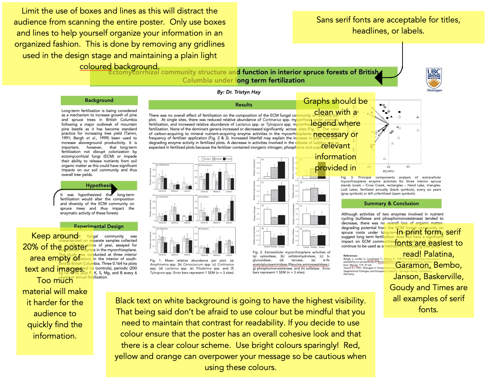
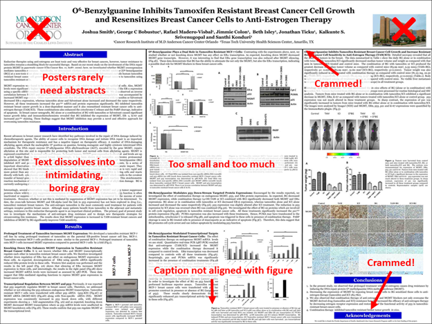

# (PART\*) Lab 10 {-}

# Poster Presentation {-}

*Last updated `r Sys.Date()`*

## What is a Research Poster? {-}

Posters are commonly used throughout the academic community to communicate scientific research to fellow scientists. What is great about a research poster is that you have the opportunity to summarize in a clear and concise way all that you have done and what you have found in a very attractive and informative format. 

Posters are typically a mix of text, figures, tables, graphs and other data. The researchers stand out in front of their poster and present their poster to a small audience (in some cases just one person will be there). Posters also allow for more in-depth conversation about the research than one would expect at a regular presentation, which is part of why scientists like them so much.

## So, what makes a good poster? {-}

* The best posters have high visual appeal, are easily read from a distance (Titles from about 10 feet, content from about 3-5 feet) and guide the reader through your work in a way that makes it easy for them to understand your research and its conclusions.
* Your title should be short but also catchy. That is, you want it to draw your audience in!
* Your overall word count should be no less than 300 words and no more than 800.
* Your content needs to be clear (i.e., easy for the audience to interpret without help, in case you\'re busy with someone else) and concise (stick to the point, so you get it across in the fewest possible words).
* Wherever possible use graphics, colour, font etc. to help guide your audience through the key information.
* Keep displays simple and text brief; your audience should be able to get the main points within 30 seconds. Your presentation will fill them in on the rest.
* Stay away from overly bright coloured boards. Neutral coloured boards are much more pleasing on the eye and will help ensure the content stands out more
* Bullets, numbering and headings will all help your audience to follow the presentation
* The layout should be clean and organized
* The poster must include acknowledgments, your name and the institution this project was affiliated with (So, in your case, the University of British Columbia Okanagan)

Additional Resources

[Colby College page on Student Academic posters](http://www.colby.edu/acits/student-academic-poster-guidelines/). We especially like the additional links in this one, including a nice video from University of Guelph.

[Douglas College page on Student Research Presentations](https://guides.douglascollege.ca/ResearchPoster). This link has lots of really good resources, including poster templates, potential sources for creative commons-licenced images (which means you\'re allowed to use them) and more.

## Getting started… the hardest part! {-}

Start by thinking about who this presentation is for. So, in your case you will be presenting to your BIOL116 lab mates and some of the teaching assistants.

Next think about what exactly you want to tell them. For example, to understand your research, they likely need to know what your **research question** was, how you went about **testing your hypothesis**, and, most importantly, what were the **conclusions** that you drew, based on the research that you conducted. Some of the details of your work will be vital to the understanding of the work, while others maybe don\'t need to be highlighted quite so prominently on the poster. 

Don\'t Procrastinate!

Think about these things well ahead of time and make a list of all the things you want to say and put them in a list of priority. The top items should make it on the poster while the rest can be saved for your presentation. If there was one thing you wanted your audience to know (we often call this the \'take home message\') what would that be?

Next take a step back, grab a pencil and start to sketch out a small poster to scale. What are the proportions you will be working with and what all do you need to include? Play around with the overall look placing content and diagrams/figures where you think it visually looks nice. A little bit of graphic design experience can be helpful here, but its not required. You can also do this by marking off an area on the floor or table base on the exact size of your poster, print off your content and/or diagrams and figures and see what needs to change.

Use a text hierarchy; meaning you have established a convention with the font sizes and styles that helps the audience easily recognize the order of importance of your information. Titles and subtitles should always be the largest, and visible from the furthest away (so that you can draw in potential readers to view your work). Other content can usually be a bit smaller (but still legible from at least 3-5 feet away).

# Samples & Examples {-}

There is additional information about the following example posters on [Canvas](https://canvas.ubc.ca), including a detailed breakdown of the mark we gave these posters. We have also included one more example of a scientific poster that was built for a different purpose, but we took it and applied the BIOL116 rubric to see how it would score.

## A Well Designed Poster {-}

Based on the rubric you were provided the poster below would score 93/93 (100%). Remember you do not need to follow this exactly but rather this is more to help you see how the rubric can be followed and what you need to be looking for.

## A Poster with Room for Improvement {-}

Here is an example of a poster which scored 46.5/93 (50%).

The poster shown below was one that Dr. Robin built during her Ph.D. Since this poster was developed for a different purpose than BIOL116, it had a different goal than your BIOL116 poster, and was considered to be an excellent poster for that purpose. If we apply the BIOL116 poster rubric to the poster, we see that it scores only 46.5/ 93. Not only does this show you some examples of what not to do for your BIOL116 poster session, it also highlights why it is so important you use the Rubric you are given in order to do the very best you can. 

Although the example below does have three distinct columns (as is common in academic posters) There is no experimental design described and there is no much text on this poster, making it look quite gray and boring. Charts and other data are also presented in grey, which doesn\'t help. There isn\'t enough white space, and what space there is gets further broken down by the divider lines. This is often done when students try to fit too much information on the poster. Less is more in the case of a poster! This poster and others can be found on Canvas.

# Poster Printing {-}

Professional posters are usually a printed product. Professional scientists use graphic design software, and get them printed using special large-scale printers (sometimes they even get them printed on fabric instead of paper!). However, this is very expensive, and not something we advise in this course. 

Instead, we would suggest that you use a combination of your high school art project skills, and some design software, to create a poster that follows the guidelines, without breaking the bank. The [following link shows an undergraduate research day by undergraduate students of Douglas College, in New Westminster, BC](https://www.flickr.com/photos/48875799@N03/sets/72157623621098575/show/). Their posters are great examples of lower cost alternatives that make for great posters.

This would also be a good opportunity to review the [data presentation guidelines](https://ubco-biology.github.io/Procedures-and-Guidelines/figures-tables.html) in the Procedures and Guidelines manual.

Additional Software Options

[PowerPoint](https://it.ubc.ca/services/desktop-print-services/software-licensing/microsoft-365-office-students) Available to all UBC students for free, through Microsoft 365. [UBC also has PowerPoint Poster Templates](https://brand.ubc.ca/guidelines/downloads/print-and-presentation-templates/) that you can use for inspiration.

Adobe Illustrator, Photoshop, and InDesign. This software is accessible using the Apple computers along the North wall of the [Library](https://library.ok.ubc.ca/) during regular hours. This software is also accessible in SCI 128; the following times in SCI 128 are subject to change:

* **Monday** 6:00am - 10:30am & 12:00pm onward
* **Tuesday** 6:00am - 9:30am & 12:00pm onward
* **Wednesday** 6:00am - 8:0am & 12:00pm onward
* **Thursday** 6:00am - 9:30am & 12:00pm onward
* **Friday** 6:00am - 9:30am & 12:00pm onward

Open-source alternatives include:

* [Canva](https://www.canva.com/) It has a 30-day free trial template specifically, but lots of digital design options.
* [Inkscape](https://inkscape.org/) An open-source alternative to Adobe products.
* [Biorender](https://biorender.com/) More of a cell and molecular biology tool, but it has some cool graphics and templates that might be helpful to you.

# Presenting Your Poster {-}

Now that you\'ve got the poster, it\'s time for the poster session, where you will be presenting your poster to your classmates.

You can think of your poster presentation as a type of performance, but also a conversation with your audience. You should know what you want to tell them, but also be prepared for the fact that they will have questions, and specific interests. Before you present, you will need to prepare, much like any singer or actor. This is going to set you up for success!

Rehearse & Get Feedback

Rehearse what you will be saying to your friends and/or family and ask for feedback. Were you speaking at a normal pace? Were you fidgety? Did your voice carry well enough so that everyone could hear clearly? We often don\'t realize some of the things we do out of habit when we get nervous or are feeling a bit uncertain and so getting that feedback can help you determine where you need to put your energy.

The more you practice the more comfortable you will be presenting on the day of your presentations. Also have you friends and/or family ask questions to be sure you have a solid understanding of the material you are presenting. You may even want to give them some example questions alongside questions they will have on their own.

Before the poster presentations begin you will want to be sure you are comfortable with the following information:

* Know exactly what your figures, diagrams, tables and poster are telling the audience. You should have no trouble explaining anything found on your poster
* Have a real brief summary memorized in your head. A couple sentences that can give a good overview.
* Have a clear understanding of the key points of your research without needing notes.
* Be ready! Be ready to answer any question with confidence! Be comfortable being able to deal with difficult question that you may not be able to answer fully. (This is why it is always great to have someone not involved in your research ask you questions).

Never forget...

This is YOUR research, and no one knows it better than you! You have worked hard all term to get to this point, and you should be proud of the work that you did! Presenting your work can be scary, but also exciting and fun! It means you made to the end, and you’ve accomplished something. That is something to celebrate!

# Lab 10 Rubric {-}

**\ /93**

### Title {-}

**\ /10**

| Points | Criteria |
| :--- | :--- |
| Exceeds Expectations 10 pts | Title is clear, concise and accurate representation of the experiment |
| Meets Expectations 7.5 pts | Title is a mostly clear, concise and accurate representation of the experiment. Might be misplaced. |
| Below Expectations 5 pts | Title is no clear or partially clear, OR is a poor representation of the experiment. |
| Not Acceptable 2.5 pts | Title is not complete, AND is poorly written. |
| Not Present 0 pts | Not present. |

### Experimental Design {-}

**\ /24**

| Points | Criteria |
| :--- | :--- |
| Exceeds Expectations 24 pts | Procedure is specific, address the question or problem, defines data collection clearly and specifies an appropriate control and independent and dependent variable(s). |
| Meets Expectations 18 pts | Procedure is somewhat specific, addresses the question or problem and defines data collection fairly clearly with the appropriate controls and variables explained. |
| Below Expectations 12 pts | Procedure is not specific, OR does not address the question or problem, OR does not define data collection clearly or specify the control and dependent and independent variables. |
| Not Acceptable 6 pts | Procedure is not specific, AND does not address the question or problem, AND does not define data collection clearly or specify the control and dependent and independent variables. |
| Not Present 0 pts | Procedure is no present. |

### Background {-}

**\ /12**

| Points | Criteria |
| :--- | :--- |
| Exceeds Expectations 12 pts | Relevant biology background is included, properly explained &amp; integrated with key findings. No factual errors. |
| Meets Expectations 9 pts | Relevant background information is mostly present, AND is mostly correct (only one minor error), but not well integrated. |
| Below Expectations 6 pts | Relevant background is confusing, OR has multiple minor errors AND is not well integrated. |
| Not Acceptable 3 pts | Relevant background has major errors, but still present. |
| Not Present 0 pts | Background is missing. |

### Figures {-}

**\ /14**

| Points | Criteria |
| :--- | :--- |
| Exceeds Expectations 14 pts | Figure is included, describes key findings, includes controls, experiment is well-explained and integrates will with the summary of research findings. figure has a legend in authors own words AND is mentioned in text. |
| Meets Expectations 10.5 pts | Figure describes key findings, includes controls, explanation of experiment is mostly good, integrates well with research findings. Author has described experiment in text AND figure legend is in own words. Only minor technical errors in explanation of figure. |
| Below Expectations 7 pts | Not the best choice of figure (OR is incomplete but explanation is adequate), is partially explained, and/or has some incorrect interpretations. Author has either forgotten to include a figure legend (OR cut and paste figure legend from paper) OR not described figure in text (but legend does an adequate job). |
| Not Acceptable 3.5 pts | Figure is present but is a poor choice OR is present but not explained in text/figure legend OR figure is not included but is adequately explained. |
| Not Present 0 pts | Figure is not present, and not mentioned. |

### References & Citation {-}

**\ /8**

| Points | Criteria |
| :--- | :--- |
| Exceeds Expectations 8 pts | APA format is used properly &amp; consistently throughout. Sources are referenced as required. No more than 2 missed in-text citations, and no mismatches between citations &amp; reference list. |
| Meets Expectations 6 pts | APA format is mostly properly used, errors are minor AND consistent. Primary papers are cited at least twice where it is discussed, but could be cited more. Reference list is present, formatted consistently and no more than one mismatch. |
| Below Expectations 4 pts | APA formatting is not properly used OR formatting is inconsistent. Primary papers are cited in-text, but less than once. Other sources are cited as required. Reference list is present, but has mismatches with in-text citations. |
| Not Acceptable 2 pts | APA formatting is not properly used OR formatting is inconsistent. Either in-text citation OR reference list is missing. Primary paper(s) are cited in text once only (or listed in the reference list with no in-text citation). Multiple mismatches between in-text citations and reference list. |
| Not Present 0 pts | No in-text citations AND no reference list. If sources other than Primary papers are deemed to have been used, or plagiarism is suspected, more severe penalties may apply. |

### Spelling & Grammar {-}

**\ /5**

| Points | Criteria |
| :--- | :--- |
| Exceeds Expectations 5 pts | No more than 1 small, with no grammar errors and no awkward phrasing. |
| Meets Expectations 4 pts | No more than 3 small typos, AND only 1 grammar error. No more than one awkward sentence. |
| Below Expecttaions 3 pts | More than 3 spelling mistakes, more than 1 grammar error and one awkward sentence. |
| Not Acceptable 2 pts | Spelling errors are changing meanings of words, OR grammar is poor. Phrasing is awkward in multiple parts, and comprehension is beginning to be compromised. |
| Not Present  1 pts| Spelling and grammar are so poor that its difficult to understand. Phrasing is awkward and confusing throughout. |

### Hypothesis {-}

**\ /5**

| Points | Criteria |
| :--- | :--- |
| Exceeds Expectations 5 pts | Clearly stated in one sentence and supported by previous knowledge or research. |
| Below Expectations 3 pts | Is somewhat vague, unclear, or wordy, and is somewhat based on previous knowledge or research. |
| Not Acceptable 1 pts | Is somewhat vague, unclear, or wordy, and is somewhat based on previous knowledge or research. |
| Not Present 0 pts | Hypothesis is not present. |

### Study Significance {-}

**\ /5**

| Points | Criteria |
| :--- | :--- |
| Exceeds Expectations 5 pts | The significance of this study has on society and/or the academic community is clearly outlined. |
| Meets Expectations 3 pts | Significance of study is stated. |
| Not Acceptable 0 pts | The significance of this study is not reported |

### Results {-}

**\ /5**

| Points | Criteria |
| :--- | :--- |
| Exceeds Expectations 5 pts | Results are clearly indicated interpreted and their impact on the field has been provided |
| Below Expectations 3 pts | Results are clearly indicated, however, either no interpretation was provided or the impact the results have on the field is not provided. |
| Not Acceptable 2 pts | Results are clearly indicated; however, no interpretation was provided and the impact these results have on the field is absent. |
| Not Present 0 pts | No results were provided. |

### Display {-}

**\ /5**

Poster follows the 3.75ft by 4ft high dimensions, is attractively presented, language is simple and descriptive, spelling and grammar are correct and all texts follow the serif font and are visible from 10ft away.

| Points | Criteria |
| :--- | :--- |
| Full Marks 5 pts | All five criteria are met. |
| Proficient 4 pts | Four of the five criteria were met. |
| Satisfactory 3 pts | Three of the five criteria were met. |
| Poor 2 pts | Two of the criteria were met. |
| Unsatisfactory 1 pts | Only one criterion was met. |
| No Marks 0 pts | No criteria were met. |

